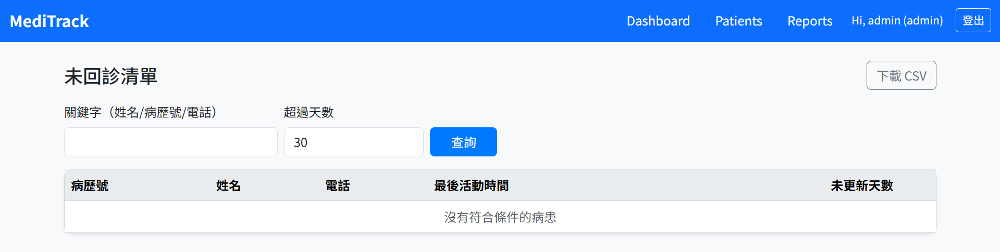

# MediTrack — 醫療資料管理系統 (Flask)

MediTrack 是一個以 **Flask + Bootstrap + Chart.js** 建立的輕量醫療資料管理平台，  
可用於追蹤病患生命徵象與檢驗數據，並產生自動化報表。

---

## 功能摘要

1. 登入系統 — Flask-Login 帳號驗證與權限控管  
2. 病患管理 — 新增 / 編輯 / 刪除 / 搜尋  
3. 趨勢圖表 — 各病患血壓、血糖折線圖 (Chart.js)  
4. Dashboard — 總病患數、高血壓比例、每週新增統計  
5. 報表中心 — 高血壓名單、血糖異常名單、未回診清單  
6. 匯出功能 — 所有報表支援 CSV 下載  

---

## 技術架構

- Backend：Flask 3.0 + SQLAlchemy + Flask-Login  
- Frontend：Bootstrap 5 + Chart.js  
- Database：SQLite（可改 MySQL）  
- Deployment：支援 venv 或 Docker 環境  

---

## 專案結構

```text
## 專案結構

```text
meditrack/
├─ app/
│  ├─ static/                 # 靜態資源（CSS、JS、圖片）
│  ├─ templates/              # 前端模板（HTML）
│  ├─ __init__.py
│  ├─ forms.py                # Flask-WTF 表單
│  ├─ models.py               # SQLAlchemy 模型
│  ├─ routes.py               # Flask Blueprint 路由
│  └─ utils.py                # 權限驗證、常數設定
│
├─ instance/
│  └─ meditrack.db            # SQLite 資料庫
│
├─ docs/
│  ├─ images/                 # 系統截圖
│  ├─ erd.png                 # 資料表關聯圖
│  └─ README.md
│
├─ reports/                   # 匯出報表資料夾
├─ tests/                     # 測試資料
├─ venv/                      # 虛擬環境
│
├─ config.py                  # 系統設定
├─ requirements.txt           # 套件需求清單
├─ run.py                     # 主程式入口
├─ seed_demo.py               # 建立範例病患資料
└─ seed_labs.py               # 建立範例檢驗資料

```

---

## 安裝與啟動

```bash
# 建立虛擬環境
python -m venv venv
.\venv\Scripts\activate

# 安裝套件
pip install -r requirements.txt

# 啟動伺服器
python run.py
```

啟動後開啟瀏覽器進入：  
http://127.0.0.1:5000/

---

## 系統截圖




---

## 作者

Blair Lin (林姿佑)  
資訊管理系學生｜醫療科技專案研究助理  
Email: tzuyuu1015@gmail.com
